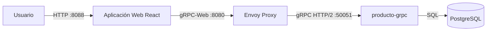
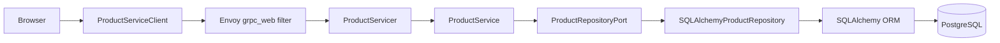
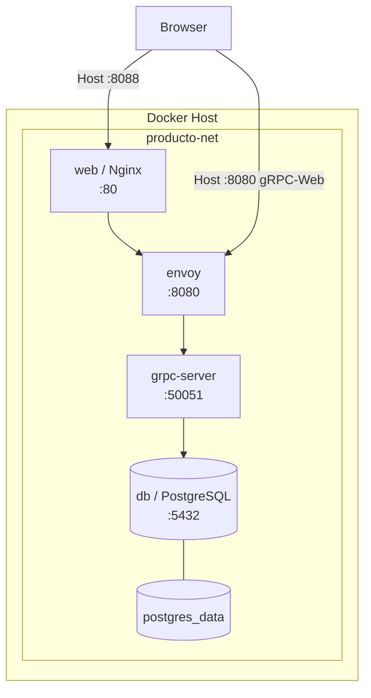
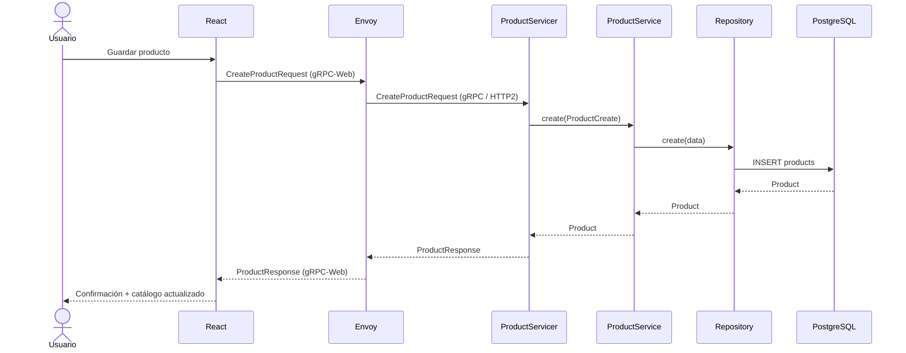
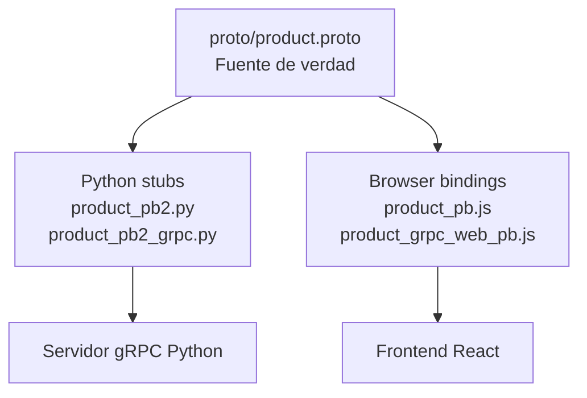

# producto-grpc-web

Aplicación de referencia para **gestionar productos desde un navegador utilizando gRPC**. La solución extiende el backend `producto-grpc` con una interfaz web en React y una capa **gRPC-Web → gRPC** basada en Envoy, manteniendo PostgreSQL y la arquitectura desacoplada del dominio.

> La idea arquitectónica central es que **React no consume PostgreSQL ni conoce la implementación Python**. El navegador conoce únicamente el contrato `product.proto`; Envoy resuelve la limitación del navegador frente al gRPC nativo y el backend conserva las mismas capas `Servicer → Service → Repository → ORM`.

---

## 1. Objetivo de la solución

El sistema permite realizar desde una interfaz web las operaciones CRUD del recurso `Product`:

- crear un producto;
- consultar productos;
- actualizar un producto;
- eliminar un producto;
- consultar el catálogo con `limit` y `offset`;
- utilizar también un cliente CLI gRPC para pruebas técnicas.

Cada producto contiene:

| Campo | Tipo lógico | Persistencia | Regla |
|---|---|---|---|
| `id` | entero | PK autogenerada | mayor que cero |
| `nombre` | texto | `VARCHAR(120)` | obligatorio |
| `descripcion` | texto | `TEXT` | opcional |
| `precio` | decimal | `NUMERIC(12,2)` | mayor que cero |

`precio` se transmite en Protobuf como `string`. Esto es intencional: evita introducir errores binarios de precisión monetaria mediante `double`; el backend convierte y valida el valor como `Decimal` antes de persistirlo.

---

## 2. ¿Por qué gRPC-Web?

Un cliente Python, Java, Go o .NET puede hablar **gRPC nativo sobre HTTP/2** directamente con el servidor. Un navegador no expone las primitivas HTTP/2 que necesita una implementación gRPC nativa convencional. Por eso el patrón habitual introduce **gRPC-Web** y un proxy compatible.

En esta solución:

```text
Browser ── gRPC-Web ──> Envoy ── gRPC/HTTP2 ──> producto-grpc
```

Envoy **no implementa lógica de negocio**. Su función es de infraestructura: recibir el protocolo gRPC-Web del navegador, aplicar CORS y traducir/proxificar la llamada hacia el servidor gRPC nativo.

La documentación oficial de gRPC-Web describe precisamente este modelo con un proxy entre navegador y servicio gRPC, y Envoy incorpora un filtro `grpc_web` para ese propósito.

Referencias técnicas:

- https://grpc.io/docs/platforms/web/quickstart/
- https://grpc.io/docs/platforms/web/basics/
- https://github.com/grpc/grpc-web
- https://www.envoyproxy.io/docs/envoy/latest/configuration/http/http_filters/grpc_web_filter

---

## 3. Arquitectura de contexto



### Responsabilidad de cada bloque

| Componente | Responsabilidad |
|---|---|
| Browser | Ejecutar la interfaz y originar acciones del usuario. |
| React | Presentación, estado de pantalla y construcción de mensajes Protobuf. |
| gRPC-Web client | Serializar/deserializar mensajes y ejecutar RPC desde el navegador. |
| Envoy | Adaptar gRPC-Web a gRPC nativo, CORS y routing. |
| ProductServicer | Adaptador de entrada del backend; traduce RPC hacia casos de uso. |
| ProductService | Reglas y casos de uso del dominio Producto. |
| Repository Port | Contrato que desacopla aplicación de persistencia. |
| SQLAlchemy Repository | Adaptador de persistencia. |
| PostgreSQL | Persistencia relacional. |

---

## 4. Arquitectura de componentes



La dependencia conceptual apunta hacia el núcleo de la aplicación. `ProductService` **no importa React, Envoy, gRPC ni PostgreSQL**. El dominio podría ser reutilizado con REST, GraphQL u otro adaptador sin modificar las reglas de negocio.

### Lectura hexagonal

```text
              ADAPTADORES DE ENTRADA
       ┌─────────────────────────────────┐
       │ Browser → gRPC-Web → Envoy      │
       │                 ↓               │
       │          ProductServicer        │
       └────────────────┬────────────────┘
                        │
                NÚCLEO DE APLICACIÓN
       ┌────────────────▼────────────────┐
       │          ProductService         │
       │     ProductRepositoryPort       │
       └────────────────┬────────────────┘
                        │
               ADAPTADOR DE SALIDA
       ┌────────────────▼────────────────┐
       │ SQLAlchemyProductRepository     │
       │             ↓                   │
       │          PostgreSQL             │
       └─────────────────────────────────┘
```

---

## 5. Arquitectura de despliegue Docker



Puertos expuestos por defecto:

| Puerto host | Componente | Propósito |
|---:|---|---|
| `8088` | Nginx / React | Interfaz web. |
| `8080` | Envoy | Endpoint gRPC-Web para el navegador. |
| `50051` | gRPC Server | Acceso gRPC nativo y cliente CLI. |
| `9901` | Envoy Admin | Diagnóstico de Envoy; útil sólo en laboratorio. |
| `5432` | PostgreSQL | **No se expone** al host en el Compose suministrado. |

En producción se recomienda no publicar `50051` ni `9901` hacia redes no confiables y colocar TLS delante de la interfaz pública.

---

## 6. Flujo completo de `CreateProduct`



La UI nunca recibe una entidad SQLAlchemy. El límite de transporte se expresa como mensajes Protobuf.

---

## 7. El contrato `.proto` como fuente de verdad

El contrato se encuentra en:

```text
proto/product.proto
```

Servicio definido:

```proto
service ProductService {
  rpc CreateProduct(CreateProductRequest) returns (ProductResponse);
  rpc GetProduct(GetProductRequest) returns (ProductResponse);
  rpc ListProducts(ListProductsRequest) returns (ListProductsResponse);
  rpc UpdateProduct(UpdateProductRequest) returns (ProductResponse);
  rpc DeleteProduct(DeleteProductRequest) returns (DeleteProductResponse);
}
```

Todas las operaciones actuales son **Unary RPC**:

```text
1 request → 1 response
```

No se usa streaming porque no aporta valor al CRUD básico. gRPC-Web puede soportar unary y, bajo condiciones específicas, server streaming; client streaming y bidirectional streaming no forman parte de este ejercicio.

### Generación derivada del contrato



Los bindings requeridos para ejecutar el proyecto ya se incluyen en el repositorio. Cuando cambie `product.proto`, deben regenerarse antes de desplegar.

---

## 8. Estructura del proyecto

```text
producto-grpc-web/
├── proto/
│   └── product.proto
│
├── app/
│   ├── core/
│   │   ├── config.py
│   │   └── logging.py
│   ├── db/
│   │   ├── base.py
│   │   ├── init_db.py
│   │   └── session.py
│   ├── products/
│   │   ├── exceptions.py
│   │   ├── model.py
│   │   ├── ports.py
│   │   ├── repository.py
│   │   ├── schemas.py
│   │   └── service.py
│   ├── grpc/
│   │   ├── generated/
│   │   │   ├── product_pb2.py
│   │   │   └── product_pb2_grpc.py
│   │   ├── mappers.py
│   │   ├── product_servicer.py
│   │   └── server.py
│   └── main.py
│
├── web/
│   ├── public/
│   │   └── index.html
│   ├── src/
│   │   ├── components/
│   │   │   ├── ProductForm.jsx
│   │   │   └── ProductTable.jsx
│   │   ├── grpc/
│   │   │   ├── product_pb.js
│   │   │   └── product_grpc_web_pb.js
│   │   ├── services/
│   │   │   └── productService.js
│   │   ├── App.jsx
│   │   ├── index.jsx
│   │   └── styles.css
│   ├── Dockerfile
│   ├── nginx.conf
│   ├── package.json
│   └── webpack.config.js
│
├── envoy/
│   └── envoy.yaml
│
├── client/
│   └── product_client.py
│
├── scripts/
│   ├── generate_proto.py
│   ├── generate_web_proto.sh
│   └── healthcheck.py
│
├── docs/diagrams/
├── tests/
├── Dockerfile
├── docker-compose.yml
├── .env.example
├── requirements.txt
└── README.md
```

---

## 9. Responsabilidad detallada de las capas

### `web/`

Es el adaptador de presentación. React mantiene el estado de la interfaz, muestra el catálogo y captura los formularios. No accede directamente a base de datos ni implementa reglas de dominio.

`web/src/services/productService.js` constituye la frontera entre los componentes React y gRPC-Web. Los componentes no necesitan conocer `BinaryReader`, `MethodDescriptor`, Envoy ni detalles de transporte.

### `envoy/`

`envoy/envoy.yaml` configura:

- listener gRPC-Web en `:8080`;
- filtro `envoy.filters.http.grpc_web`;
- filtro CORS;
- cluster HTTP/2 hacia `grpc-server:50051`;
- administración en `:9901`.

### `app/grpc/`

Es el adaptador de entrada del backend. `ProductServicer` recibe mensajes Protobuf, ejecuta validaciones de frontera, instancia el caso de uso y traduce errores a códigos gRPC.

### `app/products/`

Contiene el núcleo del caso de uso Producto:

- `schemas.py`: validaciones de entrada;
- `service.py`: casos de uso;
- `ports.py`: puerto del repositorio;
- `repository.py`: adaptador SQLAlchemy;
- `model.py`: modelo ORM;
- `exceptions.py`: errores del dominio/aplicación.

### `app/db/`

Construye engine y sesiones SQLAlchemy y asegura la existencia del esquema.

---

## 10. Mapeo de errores

El backend convierte errores técnicos y de validación a semántica gRPC:

| Situación | Código gRPC |
|---|---|
| Request válido | `OK` |
| ID/precio/datos inválidos | `INVALID_ARGUMENT` |
| Producto inexistente | `NOT_FOUND` |
| Error inesperado de persistencia | `INTERNAL` |

El frontend recibe estos errores a través del callback de gRPC-Web y los presenta como mensajes de interfaz.

---

## 11. Requisitos

### Para ejecutar todo con Docker

- Docker Engine;
- Docker Compose v2;
- puertos `8088`, `8080`, `50051` y `9901` libres.

No es necesario instalar Python, Node.js, PostgreSQL ni Envoy en el host para la ejecución Docker.

### Para desarrollo local

- Python 3.13 recomendado;
- Node.js 22 recomendado;
- npm;
- `protoc` si se va a modificar el contrato;
- `protoc-gen-grpc-web` si se van a regenerar los bindings del navegador.

---

## 12. Inicio rápido

### 12.1 Entrar al proyecto

```bash
cd ~/proyectos/producto-grpc-web
```

Si integraste estos archivos dentro del repositorio `producto-grpc`, utiliza esa ruta en su lugar.

### 12.2 Crear `.env`

```bash
cp .env.example .env
```

Verifique:

```bash
cat .env
```

Configuración suministrada:

```dotenv
APP_NAME=producto-grpc
GRPC_HOST=0.0.0.0
GRPC_PORT=50051
GRPC_MAX_WORKERS=10
DATABASE_URL=postgresql+psycopg://producto:producto@db:5432/producto
LOG_LEVEL=INFO
POSTGRES_DB=producto
POSTGRES_USER=producto
POSTGRES_PASSWORD=producto
```

### 12.3 Construir e iniciar

```bash
docker compose up --build -d
```

### 12.4 Validar contenedores

```bash
docker compose ps
```

Se esperan cuatro servicios:

```text
db
grpc-server
envoy
web
```

### 12.5 Abrir la aplicación

Desde el mismo servidor:

```text
http://localhost:8088
```

Desde otro equipo de la LAN:

```text
http://IP_DEL_SERVIDOR:8088
```

La aplicación calcula el endpoint gRPC-Web utilizando ese mismo hostname y el puerto `8080`:

```text
http://IP_DEL_SERVIDOR:8080
```

Por ello, si se accede desde otra máquina de la LAN, **los puertos 8088 y 8080 deben ser alcanzables desde esa máquina**.

---

## 13. Logs y diagnóstico

Todos los servicios:

```bash
docker compose logs -f
```

Sólo backend:

```bash
docker compose logs -f grpc-server
```

Sólo Envoy:

```bash
docker compose logs -f envoy
```

Sólo frontend:

```bash
docker compose logs -f web
```

Estado y puertos:

```bash
docker compose ps
```

Health del backend:

```bash
docker inspect --format='{{json .State.Health}}' $(docker compose ps -q grpc-server)
```

Admin de Envoy en laboratorio:

```text
http://localhost:9901/
```

---

## 14. Probar gRPC nativo con el cliente CLI

El frontend usa gRPC-Web. Para comprobar independientemente el backend puede utilizarse el cliente Python.

Crear entorno:

```bash
python3 -m venv .venv
source .venv/bin/activate
pip install -r requirements.txt
```

Crear producto:

```bash
python -m client.product_client create \
  --nombre "Monitor 27" \
  --descripcion "Monitor IPS QHD" \
  --precio "1299999.90"
```

Listar:

```bash
python -m client.product_client list
```

Consultar:

```bash
python -m client.product_client get 1
```

Actualizar:

```bash
python -m client.product_client update 1 \
  --nombre "Monitor 32" \
  --descripcion "Monitor 4K" \
  --precio "1899999.00"
```

Eliminar:

```bash
python -m client.product_client delete 1
```

La diferencia es importante:

```text
Cliente Python ─────────────── gRPC nativo ──────────────> :50051
Browser React ── gRPC-Web ──> Envoy ── gRPC nativo ─────> :50051
```

---

## 15. Ejecutar pruebas automatizadas

```bash
python3 -m venv .venv
source .venv/bin/activate
pip install -r requirements-dev.txt
pytest
```

Con cobertura:

```bash
pytest --cov=app --cov-report=term-missing
```

Las pruebas del backend emplean SQLite en memoria para aislar los casos de uso y el transporte gRPC de PostgreSQL.

---

## 16. Regenerar código Protobuf Python

Cuando cambie `proto/product.proto`:

```bash
source .venv/bin/activate
python scripts/generate_proto.py
```

Se actualizan:

```text
app/grpc/generated/product_pb2.py
app/grpc/generated/product_pb2_grpc.py
```

El Dockerfile del backend también ejecuta la generación durante el `docker build`, por lo que el `.proto` sigue siendo la fuente autoritativa.

---

## 17. Regenerar bindings gRPC-Web

Los bindings web incluidos permiten ejecutar la solución inmediatamente. Si cambia el contrato, instale las herramientas oficiales y regenere:

```bash
cd web
npm install
cd ..

./scripts/generate_web_proto.sh
```

El script requiere en `PATH`:

```text
protoc
protoc-gen-js
protoc-gen-grpc-web
```

El `protoc-gen-js` ya figura como dependencia de desarrollo del frontend; `protoc` y `protoc-gen-grpc-web` se instalan como herramientas de compilación del desarrollador/CI.

Salida esperada:

```text
web/src/grpc/product_pb.js
web/src/grpc/product_grpc_web_pb.js
```

---

## 18. CORS y Envoy

La aplicación web se sirve por `:8088` y Envoy recibe gRPC-Web por `:8080`; desde la perspectiva del navegador son orígenes diferentes debido al puerto. Por eso `envoy.yaml` configura CORS y expone los headers gRPC necesarios.

Flujo:

```text
Origin: http://servidor:8088
              │
              │ POST application/grpc-web-text
              ▼
       http://servidor:8080
              │
              ▼
            Envoy
```

Si el navegador muestra un error CORS, revise primero:

```bash
docker compose logs envoy
```

Y en DevTools → Network inspeccione la solicitud `OPTIONS`/`POST` hacia `:8080`.

---

## 19. Transacciones

`ProductServicer` crea un `ProductService` dentro de un contexto de sesión por RPC. Si el caso de uso termina correctamente se confirma la transacción; si se produce una excepción se ejecuta rollback.

```text
RPC
 │
 ▼
abrir Session
 │
 ▼
ProductService
 │
 ├── éxito ──────> COMMIT
 │
 └── excepción ──> ROLLBACK
                   │
                   ▼
                cerrar Session
```

Esto evita mantener una única sesión global compartida entre solicitudes concurrentes.

---

## 20. Health Check y Reflection

El servidor registra, además de `ProductService`:

- **gRPC Health Checking** para que Docker pueda determinar si el proceso realmente está sirviendo;
- **Server Reflection**, útil con clientes de diagnóstico como `grpcurl`.

Esto es especialmente importante porque un proceso puede estar vivo pero no necesariamente listo para recibir RPC.

---

## 21. Decisiones arquitectónicas principales

### ADR-01 — Protobuf como contrato

**Decisión:** el contrato público se define en `product.proto`.

**Motivo:** tipado explícito, generación multi-lenguaje y reducción del acoplamiento entre frontend y backend.

### ADR-02 — gRPC-Web + Envoy para navegador

**Decisión:** el navegador usa gRPC-Web y Envoy adapta hacia gRPC nativo.

**Motivo:** un navegador no consume el protocolo gRPC nativo convencional de la misma forma que un cliente backend.

### ADR-03 — Lógica fuera del Servicer

**Decisión:** `ProductServicer` es un adaptador; los casos de uso viven en `ProductService`.

**Motivo:** evitar acoplar negocio al protocolo de transporte.

### ADR-04 — Repositorio detrás de puerto

**Decisión:** la aplicación depende de `ProductRepositoryPort` y no directamente de SQLAlchemy.

**Motivo:** inversión de dependencias y facilidad de pruebas/sustitución de persistencia.

### ADR-05 — Precio como string en Protobuf

**Decisión:** `precio` se transmite como texto decimal.

**Motivo:** preservar semántica monetaria exacta hasta convertir a `Decimal`.

### ADR-06 — PostgreSQL no expuesto al host

**Decisión:** la base se mantiene únicamente en `producto-net`.

**Motivo:** reducir superficie de exposición y forzar el acceso a través de la aplicación.

---

## 22. Comparación con REST y GraphQL

Manteniendo el mismo dominio Producto, pueden compararse tres adaptadores de entrada:

```text
REST
Browser → HTTP/JSON → FastAPI Router → ProductService → Repository → PostgreSQL

GraphQL
Browser → GraphQL → Resolver → ProductService → Repository → PostgreSQL

gRPC-Web
Browser → gRPC-Web → Envoy → gRPC Servicer → ProductService → Repository → PostgreSQL
```

La comparación evidencia que **REST, GraphQL y gRPC son mecanismos de interacción/contrato y no deberían obligar a reescribir el núcleo del negocio**.

---

## 23. Seguridad para producción

La configuración entregada es apropiada para laboratorio/desarrollo. Para producción debe evolucionar, como mínimo, hacia:

1. TLS entre browser y proxy (`https`);
2. TLS o mTLS entre Envoy y backend cuando el entorno lo requiera;
3. autenticación basada en token/JWT o integración con IAM;
4. CORS restringido a orígenes conocidos, no `.*`;
5. secretos fuera de `.env` versionado;
6. puerto de administración Envoy `9901` restringido a red administrativa;
7. gRPC `50051` sin exposición pública si sólo lo consume Envoy;
8. límites de tamaño de mensaje, timeouts y rate limiting;
9. migraciones de base de datos con Alembic en lugar de depender de `create_all`;
10. observabilidad con métricas, trazas y logs correlacionados.

---

## 24. Apagar y limpiar

Detener conservando datos:

```bash
docker compose down
```

Eliminar además el volumen PostgreSQL:

```bash
docker compose down -v --remove-orphans
```

Eliminar imágenes construidas por Compose:

```bash
docker compose down -v --rmi local --remove-orphans
```

> `docker system prune -a --volumes` afecta **todo Docker del host**, no sólo este proyecto.

---

## 25. Solución de problemas

### `ModuleNotFoundError: No module named 'grpc'`

Ocurre cuando se ejecuta el cliente CLI desde el host sin dependencias Python:

```bash
python3 -m venv .venv
source .venv/bin/activate
pip install -r requirements.txt
```

### La web abre pero muestra “No fue posible consultar gRPC-Web”

Compruebe:

```bash
docker compose ps
docker compose logs envoy
docker compose logs grpc-server
```

Desde otro equipo de la LAN confirme que `IP_SERVIDOR:8080` sea alcanzable.

### Envoy devuelve `503`

Normalmente significa que Envoy no puede alcanzar `grpc-server:50051` o que el backend aún no está saludable:

```bash
docker compose ps
docker compose logs grpc-server
docker compose logs envoy
```

### `vm/container port is already allocated`

Identifique quién usa el puerto:

```bash
sudo ss -lntp | grep -E ':8088|:8080|:50051|:9901'
```

Cambie el lado izquierdo del mapeo en `docker-compose.yml` si es necesario.

### Mixed Content con HTTPS

Si la UI se publica con `https://`, el navegador no permitirá llamadas a `http://...:8080`. Publique también gRPC-Web sobre TLS o coloque ambos detrás del mismo reverse proxy HTTPS.

---

## 26. Estado de validación del código entregado

El backend incluido corresponde a la implementación `producto-grpc` previamente validada con pruebas CRUD, errores y paginación. Para esta extensión se verificó adicionalmente la sintaxis de los módulos JavaScript de gRPC-Web y la consistencia estructural de los nuevos componentes.

La ejecución completa de `docker compose build` depende de acceso a los registros externos de Docker/npm/pip desde la máquina donde se despliegue.

---

## 27. Resultado arquitectónico

La solución final mantiene una separación clara:

```text
Presentación
React
   │
Transporte web
 gRPC-Web
   │
Infraestructura de adaptación
Envoy
   │
Adaptador de entrada
ProductServicer
   │
Aplicación / dominio
ProductService
   │
Puerto
ProductRepositoryPort
   │
Adaptador de salida
SQLAlchemyProductRepository
   │
Persistencia
PostgreSQL
```

Esta separación permite estudiar gRPC como una **decisión arquitectónica de integración** sin convertir la aplicación en lógica de negocio dependiente de gRPC.
